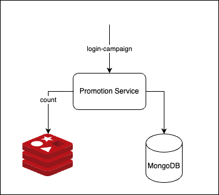

# Promotion System

## Overview
This document outlines the design for a promotion system targeting the first 100 users per campaign. Upon their first login, these users will receive a 30% discount voucher applicable to mobile phone fee top-up transactions (money transfer from bank account) made via the Cake app.

The document also addresses scalability considerations to support at least 100,000 concurrent users.

This project uses the hexagonal architecture. Reference: https://en.wikipedia.org/wiki/Hexagonal_architecture_(software)

**Note: this project focuses on how to dispatch vouchers for the first 100 users per campaign with high-performance and high-scalability. Other logics related to login, discount for topup transactions will be ignored or simplified.** 

## System Design

The promotion system has 3 main components:
* Promotion Service.
* Redis: store the counter of users who log in to the campaign.
  * key: campaign_counter_[campaignID]
  * get and increase by 1 when a new user login campaign.
  * because Redis uses single thread, so race condition problems are avoided.
* MongoDB: campaign and voucher database.
  * the table campaign is used to check if this is the first time the user logins the campaign.
It has a unique compound index of campaignID and userID making the query faster.
  * the table voucher stores voucher information of users.

### CampaignLogin

| Field       | Type   | Description        | 
|:------------|:-------|:-------------------| 
| UserID      | string | ID of the user     | 
| CampaignID  | string | ID of the campaign |
| CreatedDate | string | Time UTC +7        |

Index:
* campaign_idx (CampaignID, UserID): unique, compound

### Voucher

| Field       | Type     | Description                           | 
|:------------|:---------|:--------------------------------------| 
| _id         | ObjectID | ID of the voucher                     | 
| UserID      | string   | ID of the user                        | 
| Discount    | int      | Percent: 0 -> 100                     | 
| Description | string   |                                       |
| ExpireDate  | string   | Expire Date: Time UTC +7              |
| VoucherType | string   | Which flow the voucher can be applied |
| CreatedDate | string   | Time UTC +7                           |

Index:
* voucher_idx (UserID)

## API Spec

**POST: /api/login-campaign**

Request

| Field    | Type   | Description          | 
|:---------|:-------|:---------------------| 
| account  | string | email/phone/username | 
| password | string | password             |

Response

| Field        | Type   | Description     | 
|:-------------|:-------|:----------------| 
| status       | bool   | success or fail | 
| errorCode    | string | error code      |
| errorMessage | string | error message   |

## How can the system serve 100000 concurrent users?

### Pros and Cons of this solution

#### Pros

* The system uses atomic integer in Redis as a counter to check first 100 login campaign users. 
The data of Redis in memory make it very fast for operations. Redis also uses single thread, 
so race condition problems are avoid without locking.
* Unique compound index helps to check first time logins faster.
* Both MongoDB and Redis supports cluster and sharding. Promotion service is stateless. 
Therefore, we can scale out the system without bottleneck.

#### Cons

* LoginCampaign, Counter and Create Voucher are not in a transaction. This mean one step can fail and the other can succeed. This can lead to the inconsistency.
For example: 
  * The system have increased the counter, but at step create voucher fail. 
So we have first 100 users login campaign successfully, but only 99 vouchers are dispatched to the user.
In this case, we can retry to create voucher or decrease the counter when create voucher fail.
  * User first logins successful, but the system increases the counter fail. In this case, we can retry the increase counter operation.

* The counter is in memory, so we can lose the counter if Redis die. In this case, we can recalculate the counter from the database.

Every solution has pros and cons. In this solution, I prefer the high-performance and low-latency, but inconsistency can happen in some case.

## Improvements in the future

* The login-campaign http API in this project contains logics of counter and dispatching voucher.
We can use a message broker (like Kafka or RabbitMQ) and logics of counter and dispatching voucher are handled async 
when the system receives login-campaign events from the broker. This make the login-campaign faster and we can easily scale out the service.  

